シンボルフォントの作成チュートリアル
=====================

このリポジトリは、[アンネ・フランク・ライブラリーのサイト](http://annelibrary.github.io/)を例に、シンボルフォントの制作を体験するためのテンプレートです。グリフの一つ("eat"アイコン)、オリジナルのフォントファイル、HTML内のアイコンの記述を抜いています。


## 制作に使うもの

- Mac または Windows
- Adobe Illustrator (グリッド、ベジェ曲線を扱います)
- [IcoMoon](http://icomoon.io/) (Webアプリケーション)
- HTML / CSS の基礎知識
- このブランチをダウンロード(or クローン)したもの


## 作業の手順

[このブランチ](https://github.com/AnneLibrary/annelibrary.github.io/tree/template)を、[ダウンロード](https://github.com/AnneLibrary/annelibrary.github.io/archive/template.zip)または、[クローン](github-mac://openRepo/https://github.com/AnneLibrary/annelibrary.github.io)して、以下の手順を追って下さい。


### アイコンの作成

0. Illustratorのテンプレートファイル`icons/512x512.ait`を開きます。

	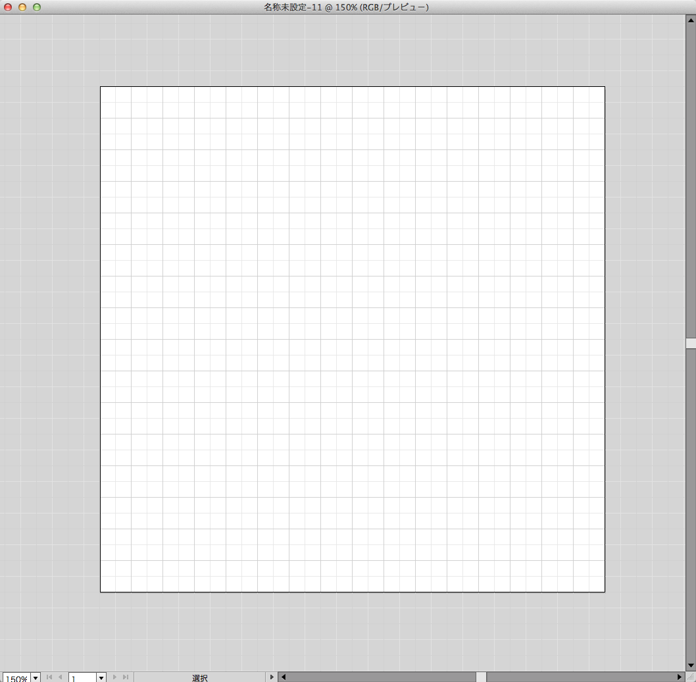
	
0. アートボードのサイズが「512 × 512px」になっていることを確認します。

	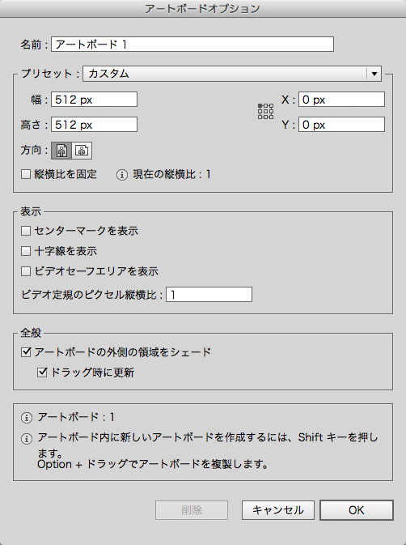
	
0. グリッド設定が「グリッド:32px」「分割数:2」になっていることを確認します。

	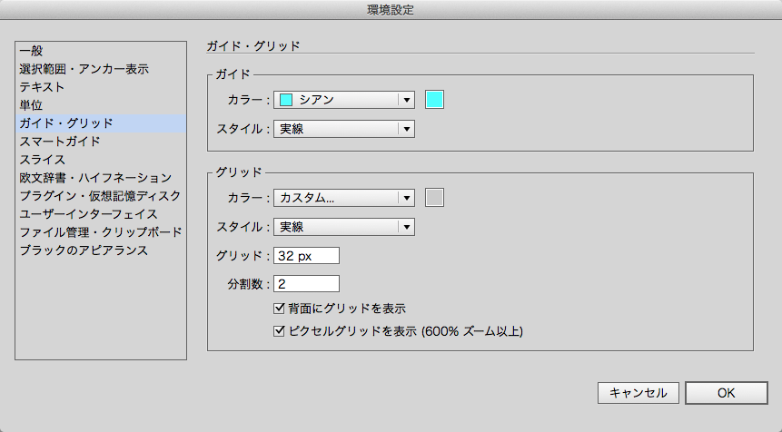
	
0. アートボードが濃いグリッドで16分割されていることを確認します。

0. 黒色で、フランクフルト(角丸長方形)と棒(長方形)を描きます。「パスファインダ」パレットから「合体」します。

	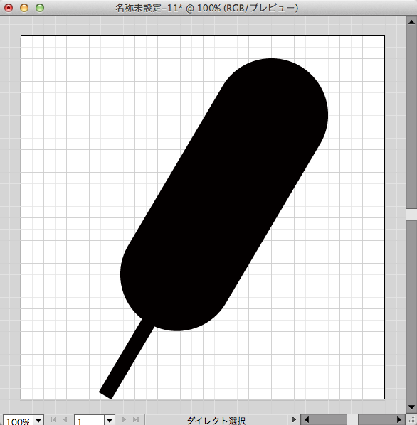
	
0. 橙色で、マスタード(波線)を描きます。一本の直線を引いて、「効果 > パスの変形 > ジグザグ」を使うと良いでしょう。

	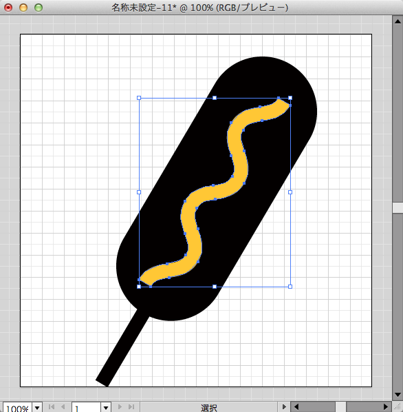
	
0. 「オブジェクト > 分割・拡張...」を選択、「オブジェクト > パス > パスのアウトライン」を選択。

0. 黒い図形と、橙色の図形を両方選択して「パスファインダ」パレットから「全面オブジェクトで型抜き」します。

	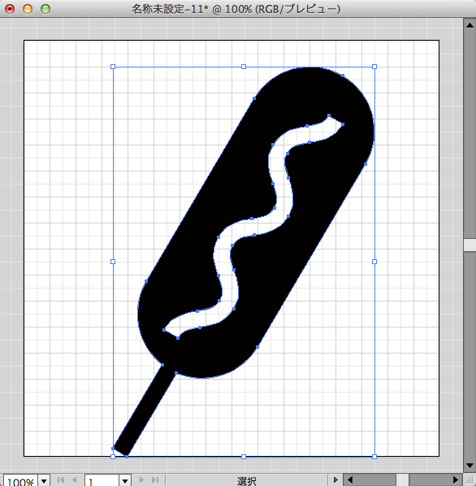

グリッドに揃えると、縮小時にもキレイに見えますが、ここでは省略します。


### SVGファイルに保存

0. 「ファイル > 保存」メニューを選択します。

	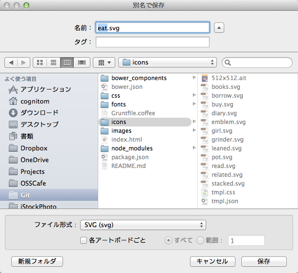
	
0. 保存場所として、`icons/`ディレクトリを指定します。保存形式は「SVG(svg)」を選びます。ファイル名は`eat.svg`として、「保存」ボタンをクリックします。

0. 「Illustratorの編集機能を保持」にチェックを入れておくと、後で変更したいときにも、グリッドが使えます。「OK」ボタンをクリックします。

	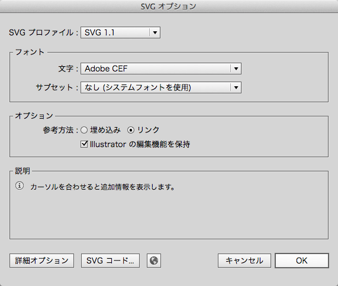


### IcoMoonでWEBフォントに変換

0. [IcoMoon App](http://icomoon.io/app/)にアクセスします。もし、選択状態のアイコンがある場合は、選択を解除しておきます。

	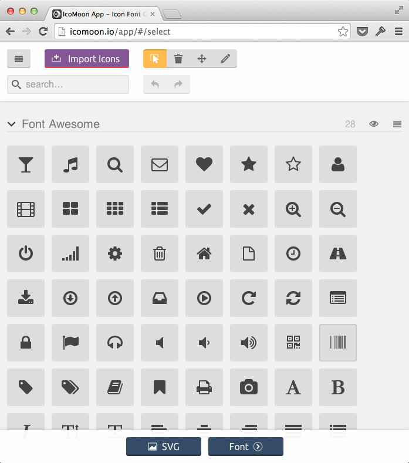
	
0. 「Import Icons」ボタンをクリックして、ファイル選択ダイアログで`icons/`ディレクトリ内のすべてのSVGファイル(`books.svg`から`stacked.svg`まで)を選択します。

	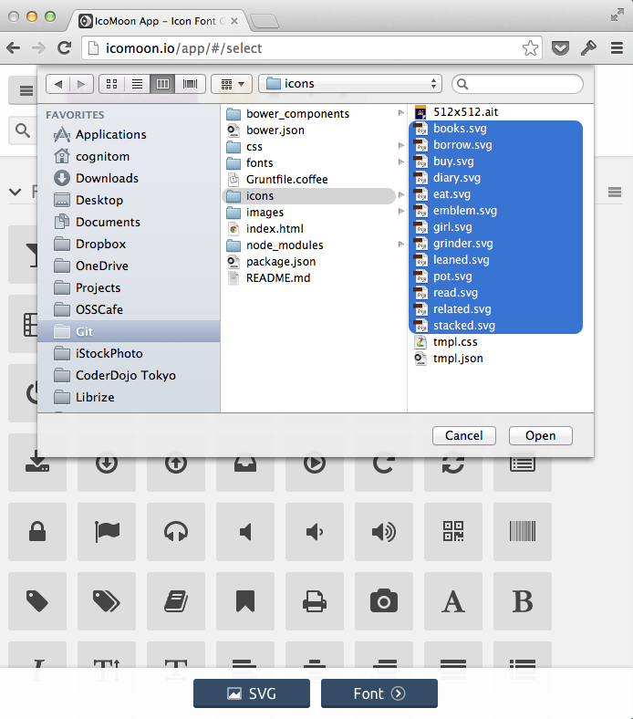
	
0. 一覧に、オリジナルのアイコンが追加されたはずです。

	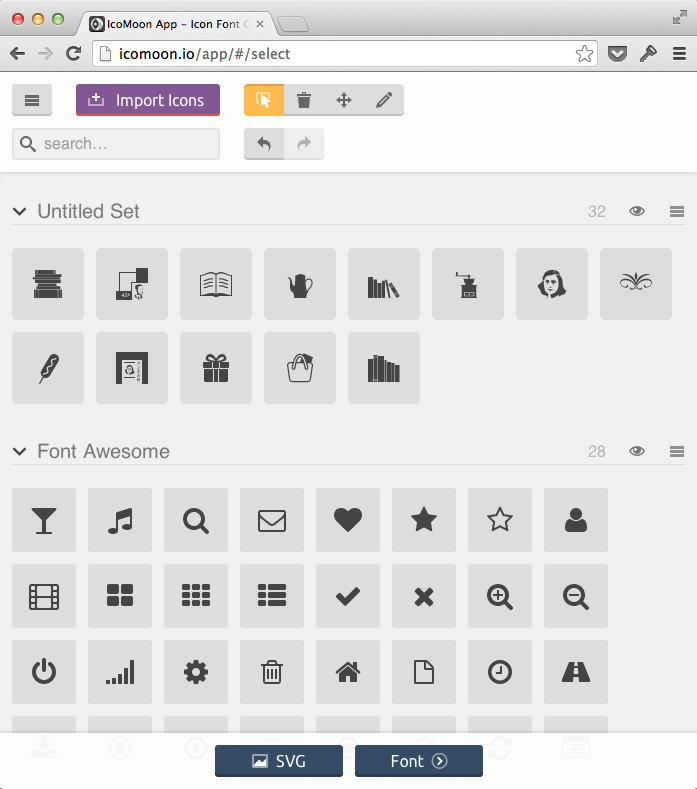
	
0. 右肩のメニューボタンをクリックして、「Select All/None」をクリックし、オリジナルアイコンをすべて選択状態にします。画面下部の「Font」ボタンをクリックすます。

	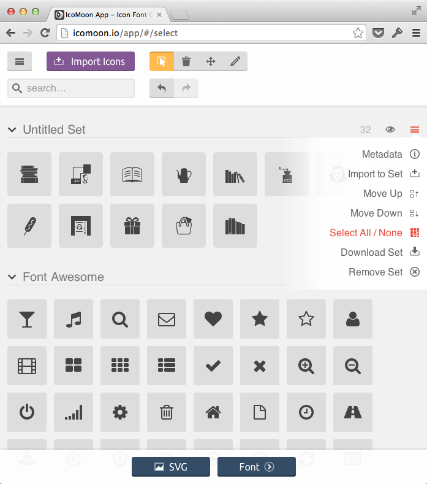
	
0. 「U+」「fi」のボタンが選択されていることを確認します。

	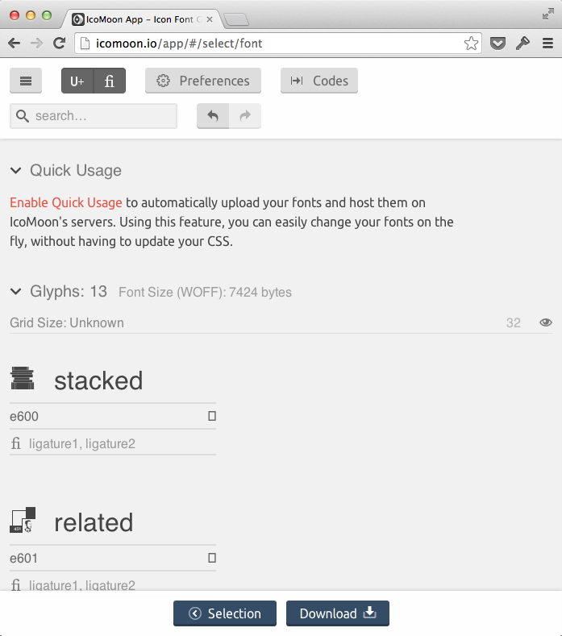
	
0. 「Preferences」ボタンをクリックして、設定画面を開きます。「Font Name: anne-library」「Class Prefix: ai-」「Use Class Selector」にチェックしてフォームに「.ai」と入力します。右上の「×」ボタンで設定画面を閉じます。(「ai」は「Anne Icon」の意です)

	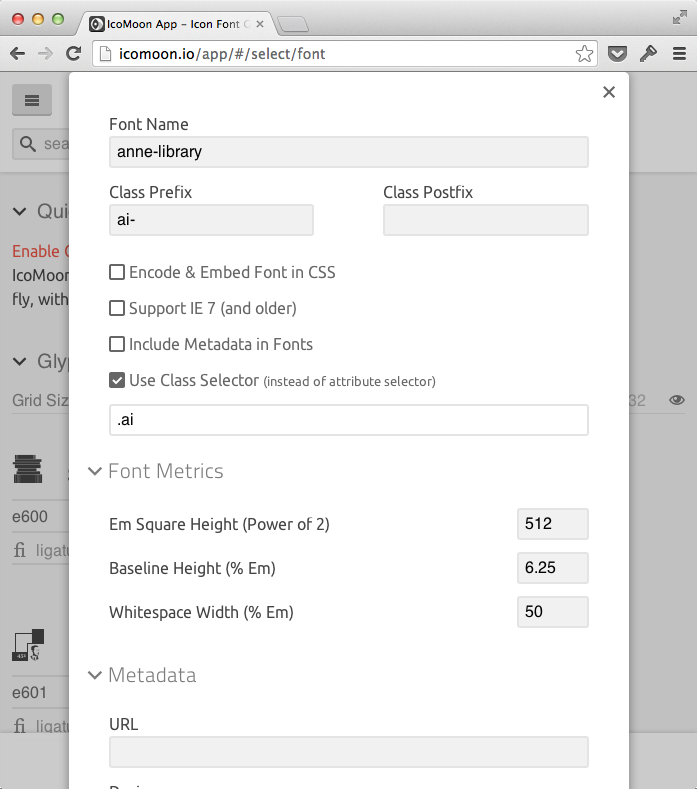
	
0. 画面下部の「ダウンロード」ボタンをクリックして、Zipファイルをダウンロード・解凍します。フォントデータとCSSが含まれていることを確認してください。

	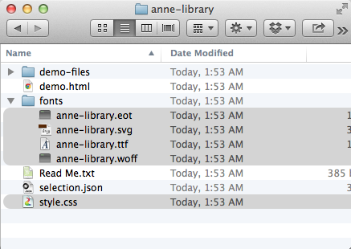


### フォントとCSSを組み込む

0. IcoMoonからダウンロードしたフォントをfontsディレクトリへ。同じくダウンロードした`style.css`は`anne-library.css`にリネームしてから、cssディレクトリへ。

	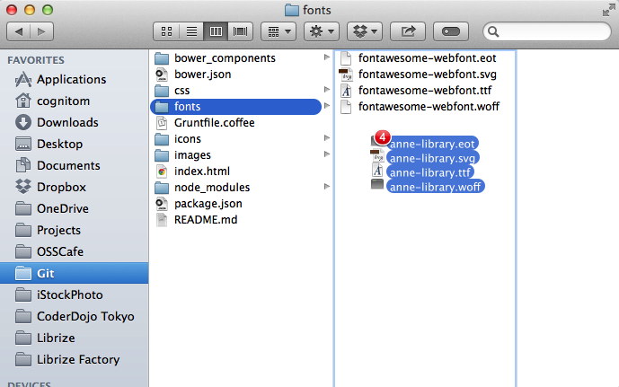
	
0. IcoMoonが生成したCSSは、同一ディレクトリにフォントのディレクトリがあることを想定しているので、`fonts/`をすべて`../fonts/`に置換します。

	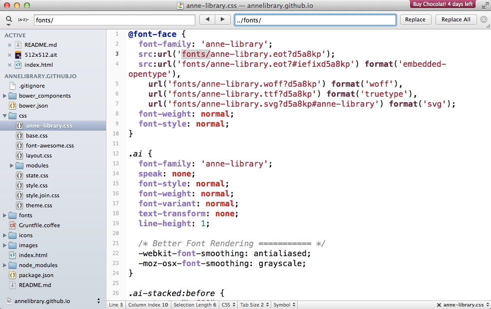


### HTMLの編集

```html
<link href="css/anne-library.css" rel="stylesheet">
```

